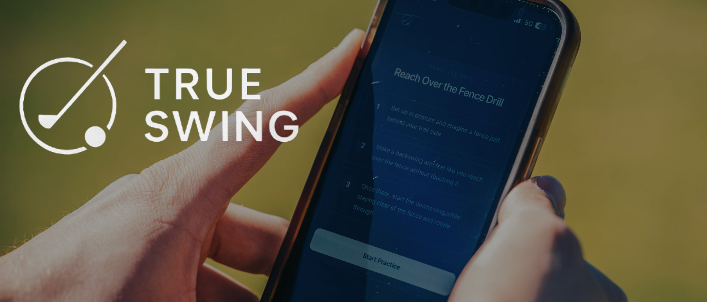

  

<h1 align="center">TrueSwing</h1>

  <strong>Not an AI coach. A practice plan you'll actually stick to.</strong>

  Stay consistent, and you'll get better.

  <a href="https://trueswing.se"><strong>Website</strong></a>
  &nbsp;·&nbsp;
  <a href="APP_STORE_URL"><strong>Download on the App Store</strong></a>

<!-- 

  You've known about your swing fault for years. Someone has already told you 
  what it is. You still grind range balls hoping it clicks, with no way to tell 
  whether any of it is working. The problem was never the diagnosis. 
  It's that nothing closes the loop.

 -->

**Start with your issue.** Upload a swing, paste your coach's notes, or pick from
the library. However you get there, you leave with one thing to work on.

**Get a program, not a drill list.** An ordered sequence of sessions that adapts
to whatever still feels rough, and sends you to the course, not just the range.

**See that you showed up.** A square for every session you finish, and periodic
re-tests where you watch your swing now against your swing then.

---

## Community & Support

- [Instagram](INSTAGRAM_URL) — swing tips, drills, and what we're building
- [Facebook](FACEBOOK_URL) — updates and community
- [Discord](DISCORD_URL) — talk to us and other players
