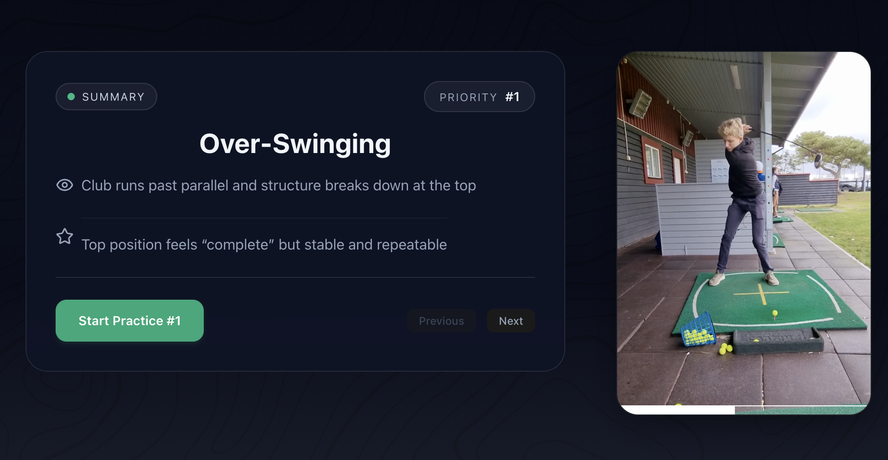
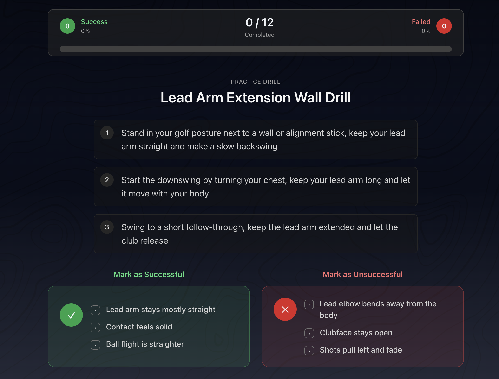

<h1 align="center">
  <a href="https://trueswing.se">
    
  </a>
</h1>

<p align="center">
  AI-powered golf swing analysis and tailored practice drills for golfers.
</p>

<p align="center">
  Turn common swing issues into clear drills, structured practice, and trackable results.
</p>

<p align="center">
  
  
  
  
</p>

<p align="center">
  <a href="https://trueswing.se"><strong>Live Demo</strong></a>
</p>

---

<p align="center">
  
  
</p>

---

## What it does

- Lets users analyse golf swings using AI-tools, generating tailored drills 
- Helps users practice specific swing issues
- Recommends drills connected to each issue
- Guides users through reps and practice sessions
- Saves results and practice history

---

## Why TrueSwing?
 
Many golfers know something is wrong in their swing but do not know exactly what to practice. TrueSwing helps players quickly identify improvement opportunities and get tailored drills they can use anytime, anywhere, so practice becomes focused instead of aimless.

---

## Features

- AI-powered golf swing analysis
- Tailored drills based on identified swing issues
- Database of common swing faults and proven corrective drills
- Guided practice flows for structured range sessions
- User authentication and saved progress
- Issue- and drill-based progression over time

---

## Tech Stack

- **Frontend:** Vite, React, TypeScript
- **Backend:** FastAPI
- **Database:** PostgreSQL, SQLAlchemy, Supabase
- **Storage:** Cloudflare R2
- **AI:** Google Gemini
- **Auth:** Supabase Auth
- **Styling:** Tailwind CSS
- **Hosting:** Hetzner
- **Containerization:** Docker

---

## Run locally

### Prerequisites

- Node.js 20+
- npm
- Python 3.11+

### Installation

```bash
git clone https://github.com/oskarjolofsson/GSA1.0.git
cd GSA1.0
```

#### React Frontend
```bash
cd frontend
npm install
npm run dev
```
Frontend runs on ```http://localhost:5173```

#### FastAPI Backend:
Open a new terminal
```bash
cd backend
python -m venv .venv
source .venv/bin/activate
pip install -r requirements.txt
uvicorn app.main:app --reload
```
Runs on ```http://localhost:8000```

### Environment variables

#### Frontend ```.env```

```env
# Backend API URL
VITE_API_URL=

# Supabase configuration
VITE_SUPABASE_URL=
VITE_SUPABASE_ANON_KEY=
```


#### Backend ```.env```

```env
# URL to React Frontend
VITE_API_URL=
VITE_API_URL2=

# OpenAI API
OPENAI_API_KEY=

# Gemini API
GEMINI_API_KEY=

# Cloudflare API
S3_API=

# Cloudflare Bucket
CLOUDFLARE_R2_ACCESS_KEY=
CLOUDFLARE_R2_SECRET_ACCESS_KEY=

# Supabase
DATABASE_URL=
DATABASE_PASSWORD=
SUPABASE_ACCESS_TOKEN=

SUPABASE_URL=
SUPABASE_ANON_KEY=
SUPABASE_SERVICE_ROLL_KEY=
```

### Tests

#### Running Tests

```bash
cd backend
pytest tests/
```

#### Test Videos (Required for running tests)

To run the test suite, you'll need two sample golf swing videos in the backend:

```bash
# Create the videos directory if it doesn't exist
mkdir -p backend/uploads/video

# Add two golf swing videos (~2 seconds each):
# - golf.mp4     (a golf swing video)
# - non_golf.mp4 (another non golf swing video)